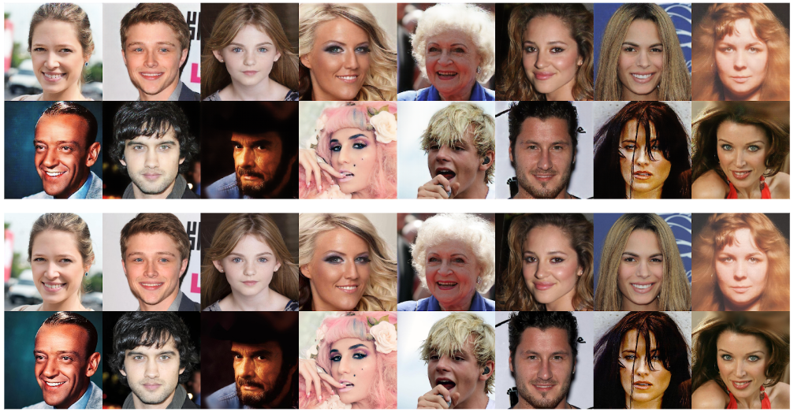
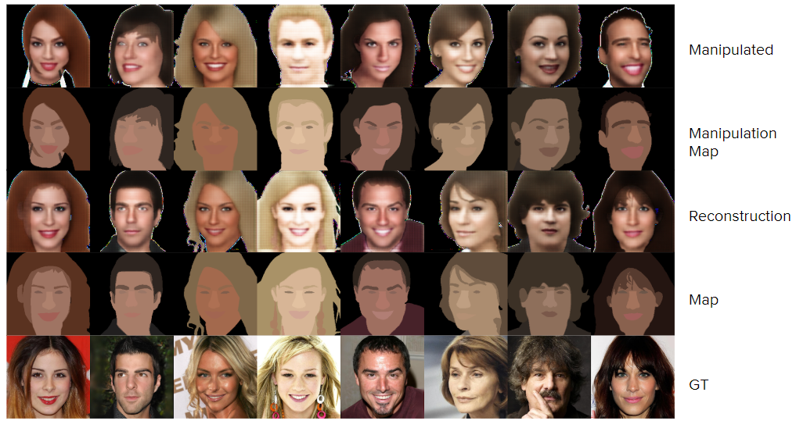

# Face Reconstruction and Manipulation From Semantic Segmentation Maps Using Generative Adversarial Networks
This project uses image-to-image translation to reconstruct and manipulate
face images from semantic segmentation maps to realistic images
using generative adversarial networks (GANs).

This is implemented using TensorFlow and a Pix2Pix-style framework following
([Isola](http://openaccess.thecvf.com/content_cvpr_2017/papers/Isola_Image-To-Image_Translation_With_CVPR_2017_paper.pdf)) and the official TensorFlow [tutorial](https://www.tensorflow.org/tutorials/generative/pix2pix) to perform facial reconstruction and
manipulation tasks like ([Lee](https://arxiv.org/pdf/1907.11922.pdf)).

## File Structure
- __face_recognition/__: Directory containing DLib resources for obtaining face IDs.
- __c_mask.py__: Generates, saves, and optionally displays average, simple color masks.
- __g_simple_mask.py__: Generates and saves npz files with the ground truth image,
binary maps, and color vector.
- __pix2pix.py__: Main file that includes helper/utility functions and sets up the
data pipeline, generator, discriminator, and training or testing environment using the
workflow that worked best, described in Figure 2 of the final paper.
- __pix2pix_v2.py__: Similar to above, except using the modified discriminator structure
described in the final paper.
- __pix2pix_rec.py__: Implementation for reconstruction only task with ground truth
input pairs of image/maps.

## Dataset
The CelebAMask-HQ dataset from (Lee) and the provided preprocessing was used.
Additional steps for processing the data to create [average color masks](./c_mask.py) and
[simplified binary masks](g_simple_mask.py) and face IDs using [DLib face recognition](./face_recognition/face_recognition.py) are included in the repo.

## Reconstruction Results

The top rows are reconstructed, and the bottom are ground truth images.

This reconstruction task uses pairs of the ground truth images and segmentation
maps, similar to (Lee).

## Joint Reconstruction and Manipulation Results

Ascending bottom to top: ground truth images, ground truth segmentation maps with average colors from the ground truth image, reconstructed images, new segmentation map with average colors from the ground truth image, manipulated image.

### Sources
    @inproceedings{CelebAMask-HQ,
      title={MaskGAN: Towards Diverse and Interactive Facial Image Manipulation},
      author={Lee, Cheng-Han and Liu, Ziwei and Wu, Lingyun and Luo, Ping},
      booktitle={IEEE Conference on Computer Vision and Pattern Recognition (CVPR)},
      year={2020}
    }

    @article{pix2pix2017,
      title={Image-to-Image Translation with Conditional Adversarial Networks},
      author={Isola, Phillip and Zhu, Jun-Yan and Zhou, Tinghui and Efros, Alexei A},
      journal={CVPR},
      year={2017}
    }

    @misc{tensorflow2015-whitepaper,
      title={ {TensorFlow}: Large-Scale Machine Learning on Heterogeneous Systems},
      url={https://www.tensorflow.org/},
      note={Software available from tensorflow.org},
      year={2015}
    }

    @Article{dlib09,
      author = {Davis E. King},
      title = {Dlib-ml: A Machine Learning Toolkit},
      journal = {Journal of Machine Learning Research},
      year = {2009},
      volume = {10},
      pages = {1755-1758},
    }
